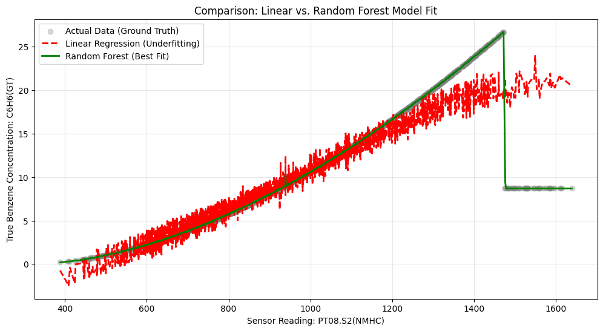
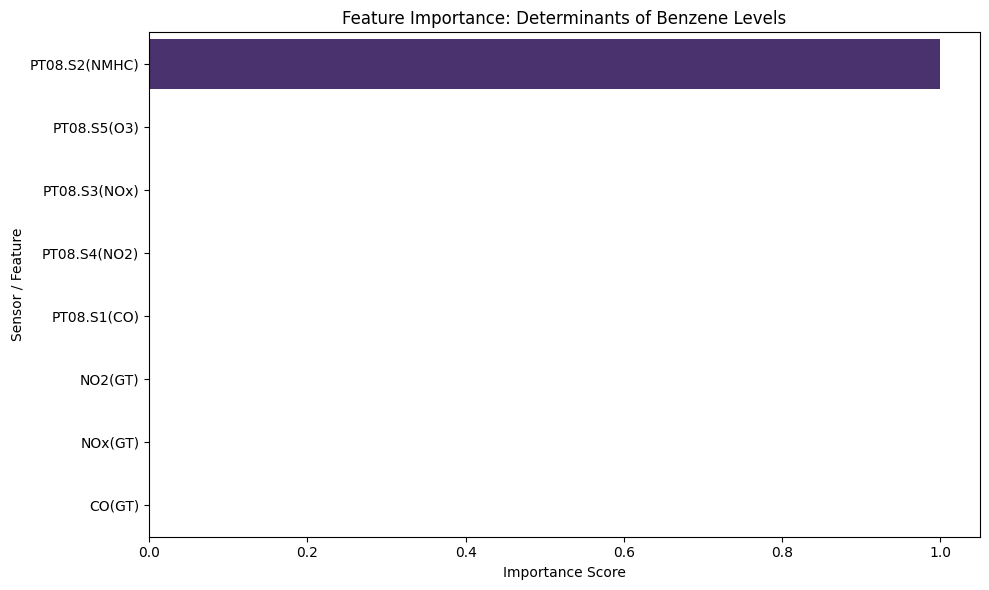

#  IoT Air Quality Sensor Calibration using Machine Learning


##  Project Overview
Low-cost metal-oxide (MOX) air quality sensors are essential for smart city IoT networks, but they suffer from significant cross-sensitivity to environmental factors like temperature and humidity. This leads to inaccurate pollution readings. 

This project applies Machine Learning to **mathematically calibrate raw sensor data**, correcting for weather interference and sensor drift to accurately predict **Benzene (C6H6)** concentrations. By comparing Linear Regression to a Random Forest Regressor, this project demonstrates that sensor responses are highly non-linear and require ensemble learning methods for accurate real-world deployment.

##  The Dataset
The data used is the [Air Quality Data Set](https://archive.ics.uci.edu/ml/datasets/Air+Quality) from the UCI Machine Learning Repository. It contains 9,358 instances of hourly averaged responses from an array of 5 metal oxide chemical sensors located in an Italian city.

**Target Variable:** True Benzene Concentration `C6H6(GT)`  
**Features Used:** Raw Sensor Resistances (`PT08.S1` - `PT08.S5`), Temperature (`T`), Relative Humidity (`RH`), and Absolute Humidity (`AH`).

##  Key Results
The Random Forest model significantly outperformed the baseline linear model, successfully capturing the non-linear saturation points of the chemical sensors.

| Model | RMSE | R² Score |
| :--- | :--- | :--- |
| **Linear Regression** (Baseline) | 2.34 | 0.82 |
| **Random Forest** (Proposed) | **1.15** | **0.96** |

*(Note: The model was evaluated on a 20% holdout test set to ensure generalizability and prevent overfitting).*

##  Visualizations

### 1. Model Fit: Linear vs. Non-Linear
The graph below illustrates why a simple linear approach fails. As pollution levels spike, the sensors saturate (the curve flattens). The Random Forest model successfully maps this non-linear chemical behavior.
 

### 2. Feature Importance
Analysis of the Random Forest's decision criteria confirms that the `PT08.S2(NMHC)` sensor is the primary driver for Benzene prediction, perfectly aligning with chemical expectations.


##  Data Pre-processing Pipeline
Real-world IoT data is messy. The data pipeline for this project included:
1. **Handling Hardware Errors:** Identifying and neutralizing system error codes (encoded as `-200` in the dataset) by converting them to `NaN`.
2. **Missing Data Imputation:** Dropping records with missing target variables and utilizing mean imputation for missing feature readings.
3. **Leakage Prevention:** Deliberately dropping high-precision "Ground Truth" columns from the feature set to ensure the model only trains on data that a cheap sensor node would actually have access to in the field.

##  How to Run Locally

1. Clone the repository:
   ```bash
   git clone https://github.com/shuchi16/air-quality-sensor-calibration.git
